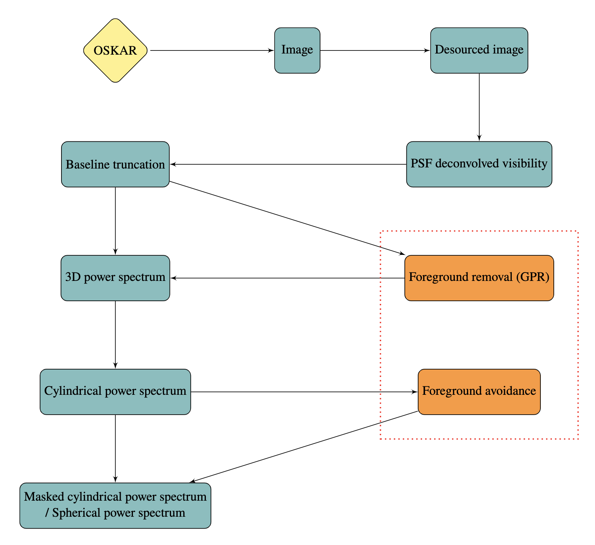

# Camrbidge SKA Science Data Challenge 3 (SKA SDC3 Cantabrigians) - Foregrounds


## Pipeline Flowchart



## OSKAR Simulation
We start the foreground mitigation with the removal of bright point sources in the SDC3 images. 

The desourcing is accomplished by performing mock SKA1-Low observations with `OSKAR` ([Dulwich et al. 2009](https://pos.sissa.it/132/031/pdf)) of the discrete sources for the entire sky.

The `OSKAR` simulator is available from [this release](https://github.com/OxfordSKA/OSKAR) and the simulation pipeline can be found [here](https://github.com/ycliu23/SKA_Power_Spectrum_and_EoR_Window), 
which is based on the [SKA End-to-End pipeline](https://github.com/oharao/SKA_Power_Spectrum_and_EoR_Window) with a modified sky model. 

The settings provided to `OSKAR`:
```
FILENAME = 'gleam_lobes'
MIN_FREQ = 106
MAX_FREQ = 196
FREQ_INTERVAL = 0.1

STATION = 'ska_one_station'
OBS_START_TIME = '2021-09-21 14:12:40.13'
OBS_LENGTH = '04:00:00'
OBS_NUM_TIMES = 1440
INT_TIME = 10

EOR = False
DIFFUSE = False
PS = True
NOISE = False
```
The modified sky model is composed of an outer sky that covers the $\mathrm{2\pi}$ steradians above the horizon and an inner sky model defined within the first null of the station beam pattern (~11.4&deg;) at 106 MHz. 

The point source model, the composite GLEAM and LoBES source catalogue, is kindly provided by the SKA Observatory in the SDC3 and can be found [here](https://drive.google.com/file/d/14nfYmwlyqL7NzMqWtMxYfaFBccrjxKll/view?usp=drive_link). 

The mock observations cover 4 hours to track the point sources in the catalogue and consist of 1440 time steps, each integrating over 10 seconds. The simulation also spans the same frequency range as in the SDC3 from 106 MHz to 196 MHz, with intervals of 0.1 MHz.

## Imaging
The imaging process utilizes `WSCLEAN` ([Offringa et al., 2014](https://arxiv.org/pdf/1407.1943.pdf)) to grid and inverse Fourier transform the visibilities generated by `OSKAR` to images by accounting for the sky curvature (ie. w-terms) and synthesized beam patterns (ie. point spread functions).
```
wsclean -reorder -use-wgridder -parallel-gridding 10 -weight natural -oversampling 4095 -kernel-size 15 -nwlayers 1000 -grid-mode kb -taper-edge 100 -padding 2 -name OUTFILE -size 256 256 -scale 128asec -niter 0 -pol xx -make-psf INFILE
```
The desourced images are obtained by subtracting the image cube of GLEAM and LoBES sources from the SDC3 image cube. As PSF deconvolution needs to be performed in the Fourier space, the images are then transformed into gridded visibilities using the Python package [ps_eor](https://gitlab.com/flomertens/ps_eor):
```
python cal_vis.py
```
We also refer interested readers to Equation (1) - (3) of [Mertens et al. (2020)](https://arxiv.org/abs/2002.07196) for more details of PSF normalization.

## Foreground Removal
This step involves Gaussian Process Regression (GPR) within a Bayesian framework. The GPR model is capable of distinguishing different components of the observed signal by pre-defining analytic forms for their covariance matrices, where the model evidence and parameter optimization are computed with the nested sampler [PolyChord](https://github.com/PolyChord/PolyChordLite/tree/master) ([Handley et al. 2015a](https://arxiv.org/abs/1502.01856), [2015b](https://arxiv.org/abs/1506.00171)).

```
python ns_gpr.py
```
After sampling the hyperparameters for the GPR model,
```
python posterior_gpr_clean.py
```
The post-processing of the MCMC sampling chain results is based on [anesthetic](https://github.com/handley-lab/anesthetic) that can be used to summarize and plot the posterior density distribution of each hyperparameter in the GPR model:
```
python posterior_plot.py
```

## Power Spectrum Analysis
Once completing the GPR foreground cleaning, the residual gridded visibilities are Fourier transformed along the frequency axis to 3D power spectra that are subsequently cylindrically averaged into the resultant 2D power spectra each $k_\parallel$ and $k_\perp$ bin, where $k_\perp^2 = \sqrt{k_x^2 + k_y^2}$ and $k_\parallel = k_z$:

```
python cal_ps.py
```

## Citation
```
@misc{SKAO_Science_Data_Challenge_3a,
author = {Liu, Y., XXX, YYY},
title = {SKAO-SDC3a},
year = {2023},
publisher = {GitHub},
journal = {GitHub repository},
doi = {xxx},
howpublished = {\url{https://github.com/ycliu23/Cambridge-SKA-SDC3-Foregrounds}}
}
```
